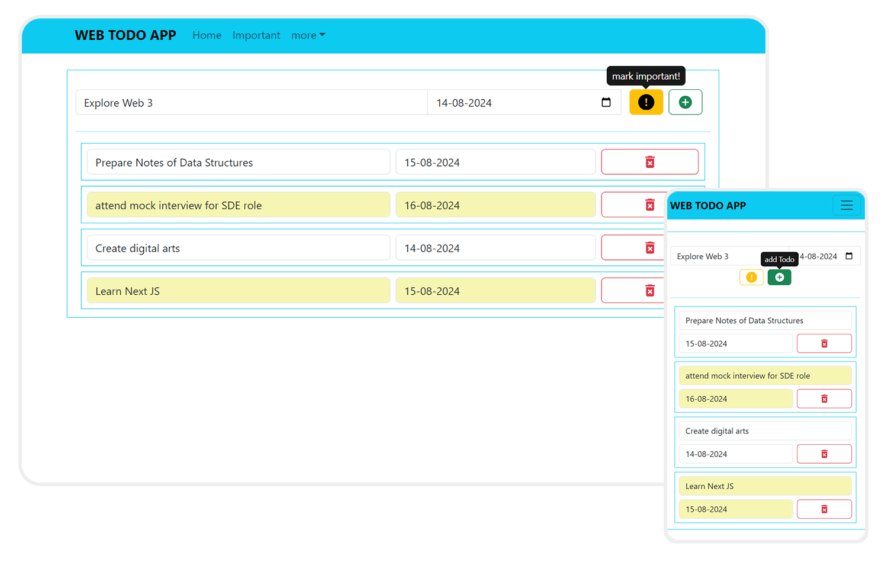
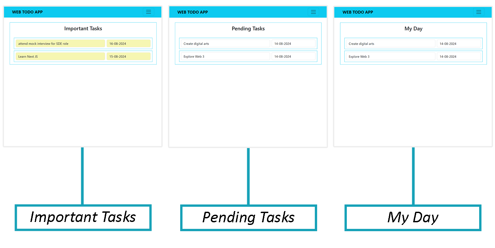

# Web Todo App

A highly responsive todo application built with React, Bootstrap, and React Router. This app allows users to manage their tasks efficiently with features like adding, marking important, deleting todos, and navigating between different task categories. User data is persisted using Local Storage, ensuring tasks are saved across sessions.

## Features

- **Add, Mark Important, and Delete Todos**
- **Separate Space for My Day, Pending Tasks, and Important Tasks**
- **Local Storage Integration** for data persistence
- **Responsive Design** using Bootstrap

## Tech Stack

- **React**
- **Bootstrap**
- **React Router**
- **Local Storage**

## Screenshots

    
    

## Installation

1. **Clone the Repo:**
   ```bash
   git clone https://github.com/jatinkaushik-jk/web-todo-app.git
   ```
2. **Install Dependencies:**
   ```bash
   npm install
   ```
3. **Run the App:**
   ```bash
   npm run dev
   ```

## Contact

Thank you for checking out the my Web Todo App! If you have any questions or suggestions, feel free to reach out to me on [LinkedIn](https://www.linkedin.com/in/jatinkaushik-jk) or [GitHub](https://github.com/jatinkaushik-jk).
